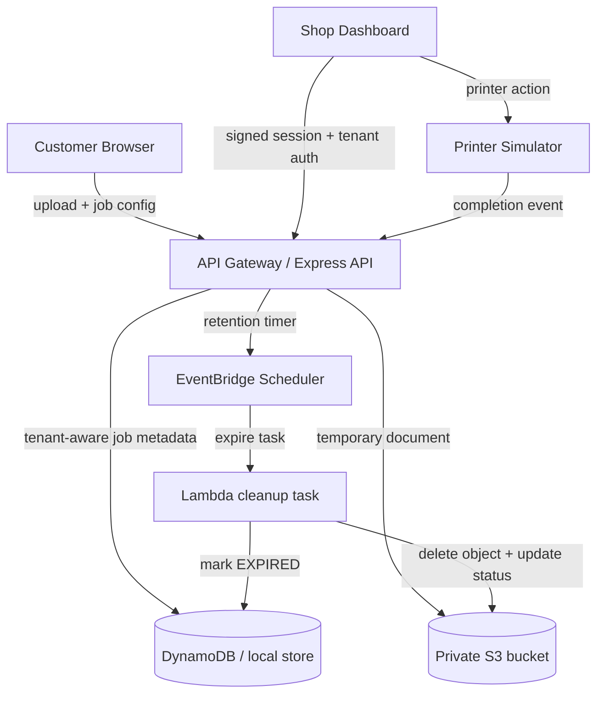

# PrivacyPrint

PrivacyPrint is a privacy-first, multi-tenant print-job platform for a hackathon demo. Customers upload temporary documents, configure print settings, send the job to a print shop, and the document is removed after its configured retention window.

## Product goals

- Customer selects a print shop and uploads a document
- Customer controls print settings: copies, pages, color, paper size, duplex, orientation, retention period
- Shop dashboard shows only jobs for the authenticated shop
- Printer simulator stands in for local printer integration
- Jobs follow a clear lifecycle: CREATED → READY → PRINTING → PRINTED → EXPIRED
- Temporary documents are removed automatically after printing and retention expires

## Architecture overview



### Current implementation status

- Frontend: React + Vite
- Backend: Node.js + Express
- Tenant model: in-memory mock data for the demo
- Document handling: local filesystem in development
- Printer flow: simulator for the hackathon demo
- AWS direction: design and templates exist for private S3 storage, with the next production step being server-side Lambda/DynamoDB/EventBridge integration

## Local development

1. Start the API:
   - cd apps/api
   - npm install
   - npm test
   - npm start
2. Start the web app:
   - cd apps/web
   - npm install
   - npm run dev
3. Open the app in the browser and use the customer or shop flow.

## Demo notes

- Demo mode accelerates the retention countdown so the expiry lifecycle is visible quickly.
- The browser cannot directly print to arbitrary local printers; the project uses a printed simulator instead.
- Temporary documents are removed after the configured retention period.
- This is a demo implementation, not a claim of forensic deletion guarantees.

## Security and privacy

- Tenant authorization is enforced server-side.
- Shops cannot access another shop's jobs.
- No permanent customer documents are committed to Git.
- File validation is enforced for type and size.
- Sensitive customer data is minimized and temporary.
- The final AWS design uses S3 private buckets, encryption at rest, short-lived signed URLs where needed, and least-privilege IAM.

## AWS production direction

The event-driven expiry worker (`services/expiry-worker/`) enforces the
retention lifecycle independently of the API process: EventBridge invokes the
`privacyprint-expiry-worker` Lambda, which deletes expired documents from S3
before marking jobs EXPIRED in DynamoDB — with retry-on-failure semantics so
an EXPIRED job can never leave a document behind.

The repository already includes a private S3 CloudFormation template under [infrastructure/s3/template.json](infrastructure/s3/template.json), which establishes the storage layer correctly for a privacy-first design:

- encrypted with SSE-S3
- bucket owner enforced
- no public access
- TLS-only access enforced
- no public bucket exposure

The next production steps, aligned with the plan, are:

1. API Gateway in front of the backend
2. Lambda handling job/business logic
3. DynamoDB for tenant and job records
4. S3 for temporary encrypted object storage
5. EventBridge or Scheduler for retention expiry tasks
6. IAM roles with least privilege
7. CloudWatch logs and monitoring
8. Tenant-isolated backend enforcement independent of frontend filtering

## AWS deployment (hackathon "Deployed, with a URL" track)

The API, expiry worker and customer web app deploy to AWS; the print connector
stays on the shop's own computer by design.

```sh
aws configure                      # your credentials; never committed
REGION=ap-south-1 ./infrastructure/deploy.sh   # add --dry-run to preview
```

The script deploys, in order: the private S3 document bucket (SSE-S3, no
public access, TLS-only), the DynamoDB job/tenant tables, the expiry-worker
Lambda (packaged from `services/expiry-worker`), the EventBridge `rate(5
minutes)` schedule, the API as a Lambda function with a public Function URL
(`infrastructure/api/`), and the customer web app to S3 static hosting —
printing the two URLs at the end.

With `DOCUMENT_BUCKET` set, documents are stored in the private S3 bucket
instead of local disk: upload happens only after content validation, deletion
precedes every EXPIRED/CANCELLED transition, and the shop connector streams
the object through the tenant-authorized `/connector/jobs/:id/document`
endpoint. Set the connector's `API_BASE_URL` to the API Function URL to
connect a shop. Tear the stacks down when the hackathon ends to stop charges.

## Hardening checklist

- Reject client-supplied tenantId when a verified session exists
- Require valid shop sessions for tenant-scoped operations in deployed environments
- Keep public buckets disabled and bucket policies restrictive
- Use short-lived signed URLs only when a document must be accessed remotely
- Validate MIME type and document size before persistence
- Ensure expiry removes temporary documents and updates job state
- Keep secrets in environment variables, never in source control
- Log job lifecycle transitions for auditability

## Run the full demo locally (zero credentials, zero cost)

Three terminals:

```bash
# 1) API
cd apps/api && npm install && npm start        # http://localhost:3001

# 2) Web app
cd apps/web && npm install && npm run dev      # http://localhost:5173

# 3) Print connector (PDF fallback — no printer needed)
cd services/print-connector
SHOP_TOKEN=<token from shop login> PRINT_MODE=pdf POLL_INTERVAL_MS=1000 npm start
```

Or, if you want API + web + connector together from the repo root:

```bash
SHOP_TENANT_ID=TENANT-002 SHOP_PASSCODE=privacyprint-demo npm run dev:all
```

Demo walkthrough:

1. **Customer**: open the web app, pick a shop, upload any PDF, set copies /
   retention, submit. A job ID is generated.
2. **Shop**: open `/shop`, select the shop, sign in with the demo passcode
   `privacyprint-demo`. The dashboard shows the job; a green
   **● Connector online** badge confirms the connector's heartbeat.
3. **Print**: click **PRINT**. The connector downloads the document and
   sends it to the real printer when CUPS is available, or produces
   `services/print-connector/output/<jobId>-print.pdf` plus a settings
   manifest in PDF fallback mode. The job turns **PRINTED** and the retention
   countdown starts (demo TTL is accelerated).
4. **Expiry**: when the countdown hits zero the job becomes **EXPIRED** and
   the temporary document is deleted. The customer can open the job's
   **Privacy receipt** to see the full lifecycle record.

Environment templates: `apps/api/.env.example`,
`services/print-connector/.env.example` (copy to `.env`, already git-ignored).

## Print Connector

A shop-side agent (`services/print-connector/`) bridges the print queue to a
real operating-system printer. A browser can never drive a physical printer,
so — like every real print service — PrivacyPrint ships a small connector that
runs on the shop's own computer: it authenticates as exactly one shop tenant
with a signed session token, or can log in itself from a shop tenant id plus
the demo passcode for local setup, polls for PRINTING jobs, downloads the
temporary document, prints it via CUPS (`lp` with whitelisted,
argument-array invocations), reports `PRINT_COMPLETED`/`PRINT_FAILED` back,
and deletes its local copy. Printer setup is **zero-touch**: the connector asks
the OS which printers exist (USB or wireless, per-queue device URIs on
CUPS / `PortName` on Windows), prefers the shop's default printer, skips virtual
queues, and publishes the printer it chose to the shop dashboard. If none is
found it re-checks and then reports a clear failure instead of pretending.
Without hardware, `PRINT_MODE=pdf` produces a
verbatim PDF copy plus a settings manifest — always labeled as PDF fallback,
never as physical printing. See `services/print-connector/README.md` for setup.

## Status

This repository is structured as a working hackathon MVP with a local backend, demo shop auth, tenant-aware job APIs, printer simulation, and retention lifecycle handling. The AWS layer is intentionally planned and scaffolded, but not yet deployed as a production cloud integration.
