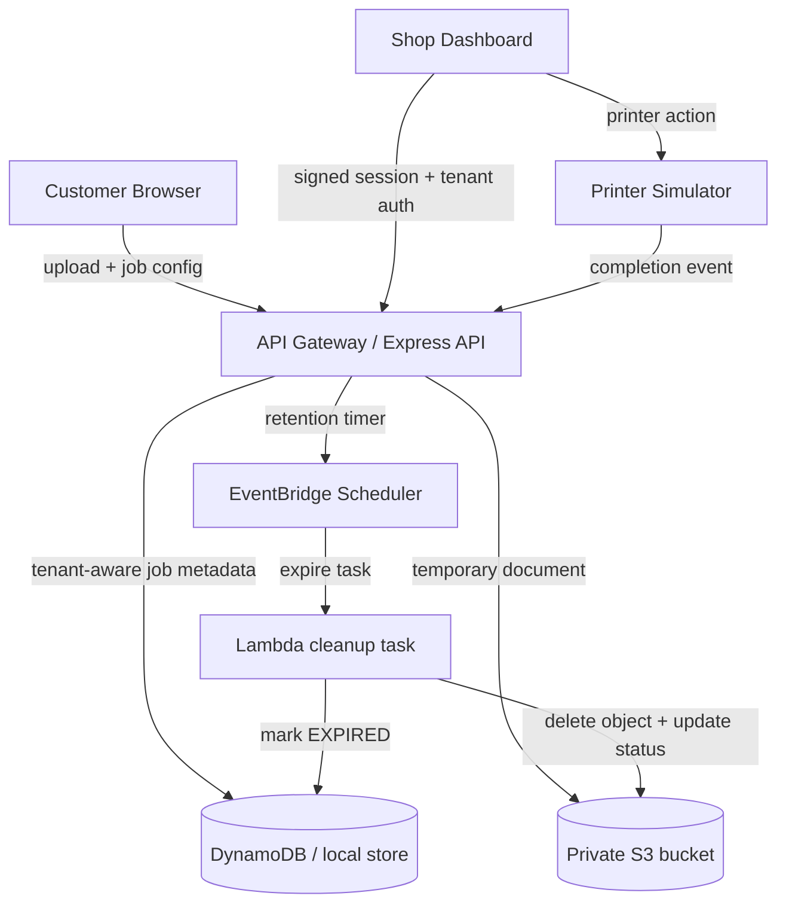

# PrivacyPrint

PrivacyPrint is a privacy-first, multi-tenant print-job platform for a hackathon demo. Customers upload temporary documents, configure print settings, send the job to a print shop, and the document is removed after its configured retention window.

## Product goals

- Customer selects a print shop and uploads a document
- Customer controls print settings: copies, pages, color, paper size, duplex, orientation, retention period
- Shop dashboard shows only jobs for the authenticated shop
- Printer simulator stands in for local printer integration
- Jobs follow a clear lifecycle: CREATED → READY → PRINTING → PRINTED → EXPIRED
- Temporary documents are removed automatically after printing and retention expires

## Architecture overview

### Current implementation status

- Frontend: React + Vite
- Backend: Node.js + Express
- Tenant model: in-memory mock data for the demo
- Document handling: local filesystem in development
- Printer flow: simulator for the hackathon demo
- AWS direction: design and templates exist for private S3 storage, with the next production step being server-side Lambda/DynamoDB/EventBridge integration

## Local development

1. Start the API:
   - cd apps/api
   - npm install
   - npm test
   - npm start
2. Start the web app:
   - cd apps/web
   - npm install
   - npm run dev
3. Open the app in the browser and use the customer or shop flow.

## Demo notes

- Demo mode accelerates the retention countdown so the expiry lifecycle is visible quickly.
- The browser cannot directly print to arbitrary local printers; the project uses a printed simulator instead.
- Temporary documents are removed after the configured retention period.
- This is a demo implementation, not a claim of forensic deletion guarantees.

## Security and privacy

- Tenant authorization is enforced server-side.
- Shops cannot access another shop's jobs.
- No permanent customer documents are committed to Git.
- File validation is enforced for type and size.
- Sensitive customer data is minimized and temporary.
- The final AWS design uses S3 private buckets, encryption at rest, short-lived signed URLs where needed, and least-privilege IAM.

## AWS production direction

The repository already includes a private S3 CloudFormation template under [infrastructure/s3/template.json](infrastructure/s3/template.json), which establishes the storage layer correctly for a privacy-first design:

- encrypted with SSE-S3
- bucket owner enforced
- no public access
- TLS-only access enforced
- no public bucket exposure

The next production steps, aligned with the plan, are:

1. API Gateway in front of the backend
2. Lambda handling job/business logic
3. DynamoDB for tenant and job records
4. S3 for temporary encrypted object storage
5. EventBridge or Scheduler for retention expiry tasks
6. IAM roles with least privilege
7. CloudWatch logs and monitoring
8. Tenant-isolated backend enforcement independent of frontend filtering

## Hardening checklist

- Reject client-supplied tenantId when a verified session exists
- Require valid shop sessions for tenant-scoped operations in deployed environments
- Keep public buckets disabled and bucket policies restrictive
- Use short-lived signed URLs only when a document must be accessed remotely
- Validate MIME type and document size before persistence
- Ensure expiry removes temporary documents and updates job state
- Keep secrets in environment variables, never in source control
- Log job lifecycle transitions for auditability

## Status

This repository is structured as a working hackathon MVP with a local backend, demo shop auth, tenant-aware job APIs, printer simulation, and retention lifecycle handling. The AWS layer is intentionally planned and scaffolded, but not yet deployed as a production cloud integration.
